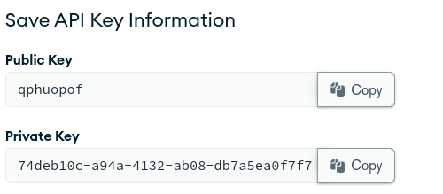

# MongoDB on Kubernetes with the MongoDB Kubernetes Operator

> MongoDB Enterprise Kubernetes Operator manages the typical lifecycle events for a MongoDB cluster: provisioning storage and computing power, configuring network connections, setting up users, and changing these settings as needed. It accomplishes this using the Kubernetes API and tools. It works together with MongoDB Cloud Manager or Ops Manager, which further configures to MongoDB clusters. When MongoDB is deployed and running in Kubernetes, you can manage MongoDB tasks using Cloud Manager or Ops Manager.

## MongoDB Enterprise Kubernetes Operator

Using the operator we can deploy

- Standalones
- Replica Sets
- Sharded Clusters
  with authentication, TLS and more.

## MongoDB Ops Manager

- The Enterprise Kubernetes Operator requires access to one of MongoDB's database
  management tools `Ops Manager` or `Cloud Manager` to deploy MongoDB instances.

- Ops Manager is the self-hosted management platform that enables you to deploy, monitor, back up, and scale MongoDB on your own infrastructure.

#### Deploying MongoDB Operator through Helm.

```shell
helm repo add mongodb https://mongodb.github.io/helm-charts
helm repo update
helm install enterprise-operator mongodb/enterprise-operator --namespace mongodb --create-namespace
```

#### Creating a secret for an admin user.

These are the details for the admin user that will be needed to Logging into
the Ops Manager

```shell
kubectl create secret generic ops-manager-secret -n mongodb \
  --from-literal=Username="krishnashed" \
  --from-literal=Password="P@ssw0rd" \
  --from-literal=FirstName="krishna" \
  --from-literal=LastName="shedbalkar"
```

### Deploying Ops Manager Resource

```yaml
# ops-manager.yaml

apiVersion: mongodb.com/v1
kind: MongoDBOpsManager
metadata:
  name: mongodb-ops-manager
spec:
  replicas: 1
  version: 6.0.0
  adminCredentials: ops-manager-secret # name of secret created
  externalConnectivity:
    type: NodePort
  applicationDatabase: # database used by ops manager
    version: "4.4.11-ent"
    members: 3 # number of members in the replica set of the application database.
```

Create Ops Manager Instance

```bash
kubectl apply -f ops-manager.yaml -n mongodb
```

Track the status of Ops Manager instance

```bash
kubectl get om -o yaml -w
```

### Configuring MongoDB Ops Manager.

Run `kubectl get all -n mongodb` and check `svc/mongodb-ops-manager-svc`

Port forward the `svc/mongodb-ops-manager-svc` or expose it as `NodePort` service to access the Ops Manager UI

```bash
kubectl port-forward svc/mongodb-ops-manager-svc 8080:8080 -n mongodb
```

Browse `http://localhost:8080` to access Ops Manager


- Login with the credentials provided during creation of `ops-manager-secret`

- Setup Ops Manager through the setup wizard. ( Optional fields can be ignored )


- Click on the Organisation available.


- To create a new organisation, click on current organisation name being displayed towards the top-left side of Organisation page, then select `View All Organisations`. And then create a new organisation.


- On the New Organisation's Page select `Access Manager` and towards top-right side click on `Create API Key`


This is the `Programmatic API Key` that the enterprise operator will use to communicate with the Ops Manager for creating resources.

- On the `Create API Key` page add all available permissions and click Next.


- Next copy the Public and Private API keys, and add the following
  CIDR Notation to the Access List Entry

`10.0.0.0/8` (This will allow IPs from 10.0.0.1 to 10.255.255.254 to connect to
the Ops Manager.)




- Create a secret for the API keys.

```shell
kubectl create secret generic api-keys -n mongodb \
--from-literal="publicKey=qphuopof" \
--from-literal="privateKey=74deb10c-a94a-4132-ab08-db7a5ea0f7f7"
```

Create a Project named `my-project` under the Organisation.


- Create a `ConfigMap` for the project.

```yaml
# project-config.yaml
apiVersion: v1
kind: ConfigMap
metadata:
  name: my-project
  namespace: mongodb
data:
  projectName: my-project # Name of Project created
  # OrgID from the OPS Manager Dashboard
  orgId: 642d5075038f061cd93def16
  baseUrl: http://mongodb-ops-manager-svc.mongodb.svc.cluster.local:8080
```

- Apply the `ConfigMap`

```bash
kubectl apply -f project-config.yaml -n mongodb
```

## Deploying MongoDB Sharded Cluster

```yaml
# mongo-shard.yaml
apiVersion: mongodb.com/v1
kind: MongoDB
metadata:
  name: mongodb-shard
spec:
  shardCount: 2 # Number of Shards
  mongodsPerShardCount: 3 # Number of Mongod instances in each shard replica set
  mongosCount: 1 # Number of Mongos Instances
  configServerCount: 3 # Number of members in the config server replica set.
  version: "4.2.2-ent"
  opsManager:
    configMapRef:
      name: my-project # Previously created project name.
  credentials: api-keys # The Secret that contains API keys.
  type: ShardedCluster
  persistent: true
```

##### Note: MongoDB Enterprise Operator uses the default storage class of the cluster.

```bash
kubectl apply -f mongo-shard.yaml -n mongodb
```

The Above configuration will create


- Verify Sharded Cluster deployment

```bash
kubectl get mdb -n mongodb mongodb-shard -o yaml -w
```

## Deploying MongoDB Replica Set

Three member replica sets provide enough redundancy to survive most network partitions and other system failures. These sets also have sufficient capacity for many distributed read operations. Replica sets should always have an odd number of members. This ensures that elections will proceed smoothly.

```yaml
# replica.yaml
apiVersion: mongodb.com/v1
kind: MongoDB
metadata:
  name: my-replica-set
spec:
  members: 3 # Number of Members in the Replica Set
  version: 4.4.0-ent
  type: ReplicaSet
  opsManager:
    configMapRef:
      name: my-project # Name of ConfigMap created
  credentials: api-keys # Secret containing API Keys
  persistent: true
```

- Create the Replica Set

```bash
kubectl apply -f replica.yaml -n mongodb
```


## Deploying MongoDB Standalone

An instance of mongod that is running as a single server and not as part of a replica set.

```yaml
# standalone.yaml
apiVersion: mongodb.com/v1
kind: MongoDB
metadata:
  name: mongodb-standalone
spec:
  version: 4.4.0-ent
  type: Standalone
  opsManager:
    configMapRef:
      name: my-project # Name of ConfigMap created
  credentials: api-keys # Secret containing API Keys
  persistent: true
```

- Deploy the Standalone resource.

```bash
kubectl apply -f standalone.yaml -n mongodb
```

## Enable TLS for a Deployment

For Ops Manager to monitor, deploy, or back up a MongoDB deployment that uses TLS, you must enable TLS for the Ops Manager project.

Refer [this](https://www.mongodb.com/docs/ops-manager/current/tutorial/enable-ssl-for-a-deployment/) for more details.

## References

- https://www.mongodb.com/docs/kubernetes-operator/master/tutorial/deploy-sharded-cluster/
- https://www.mongodb.com/docs/kubernetes-operator/master/tutorial/deploy-om-container/
- https://www.mongodb.com/docs/kubernetes-operator/master/tutorial/mdb-resources-arch
- https://github.com/mongodb/mongodb-enterprise-kubernetes/tree/master/samples
