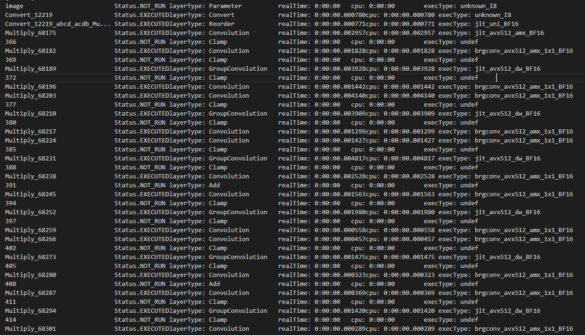
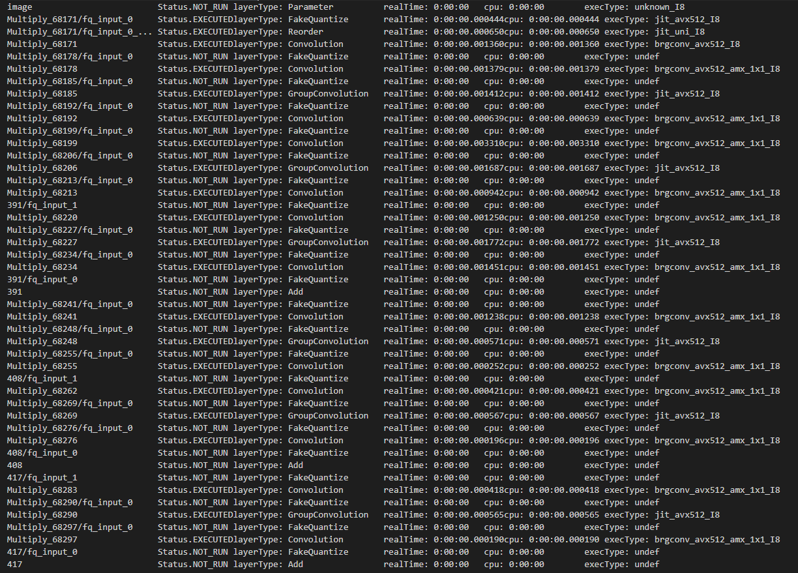

# Intel® Distribution of OpenVINO™ Toolkit

> OpenVINO is an open-source toolkit for optimizing and deploying deep learning models. It provides boosted deep learning performance for vision, audio, and language models from popular frameworks like TensorFlow, PyTorch, and more.

## Prerequisites

- Openvino

## Installation

Please run the bash script `https://github.com/krishnashed/bash_scripts_openvino/blob/main/openvino-env-setup.sh` which installs openvino in a new conda environment.

## Benchmarking on Sapphire Rapids (fourth generation Xeon Scalable Intel servers)

Enable BF16/INT8 Inference with Intel® Deep Learning Boost

The default floating-point precision of a CPU primitive is FP32. On platforms that natively support BF16 calculations with AVX512_BF16 or AMX_BF16 extensions, the BF16 type is automatically used instead of FP32. This will achieve better performance.

Using BF16 precision provides the following performance benefits:

- Faster multiplication of two BF16 numbers because of the shorter mantissa of the BF16 data.
- Reduced memory consumption since BF16 data size is two times smaller than 32-bit float.

Use the benchmark_app to check whether BF16/INT8 is enabled when running inference:

### BF16

Download FP32 model from open model zoo (or pick your own FP32 model), download horizontal-text-detection-0001 here as an example:

```shell
omz_downloader --name horizontal-text-detection-0001 --precisions FP32 -o .
```

Run benchmark app with -pc

```shell
benchmark_app -m ./intel/horizontal-text-detection-0001/FP32/horizontal-text-detection-0001.xml -pc
```

We can see some kernels are running with BF16 precison with both avx512 and amx instructions.



### INT8

Download INT8 model from open model zoo (or pick your own INT8 model), download horizontal-text-detection-0001 here as an example:

```shell
omz_downloader --name horizontal-text-detection-0001 --precisions FP16-INT8 -o .
```

Run benchmark app with -pc

```shell
benchmark_app -m ./intel/horizontal-text-detection-0001/FP16-INT8/horizontal-text-detection-0001.xml -pc
```

We can see some kernels are running with INT8 precison with both avx512 and amx instructions.



## References

- https://www.intel.com/content/www/us/en/developer/articles/technical/tuning-guide-for-ai-on-the-4th-generation.html
